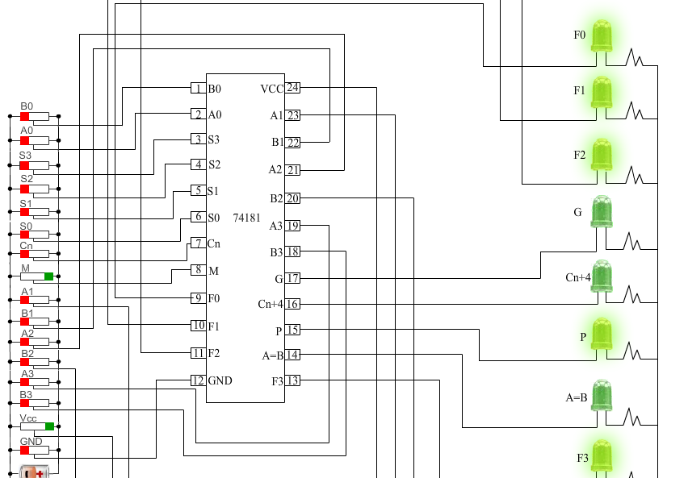
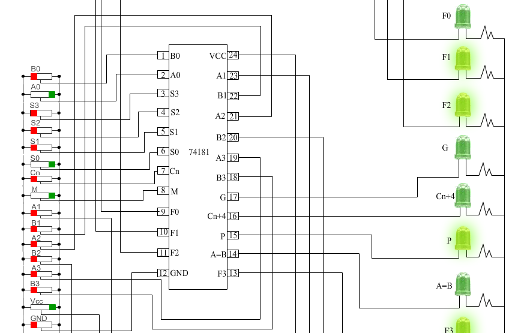
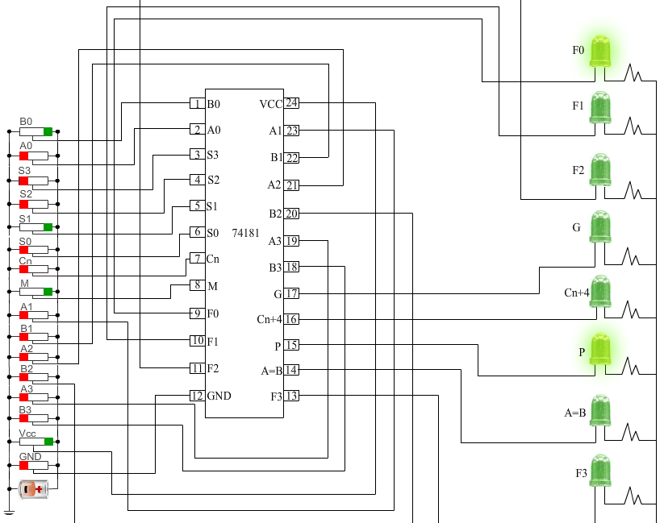
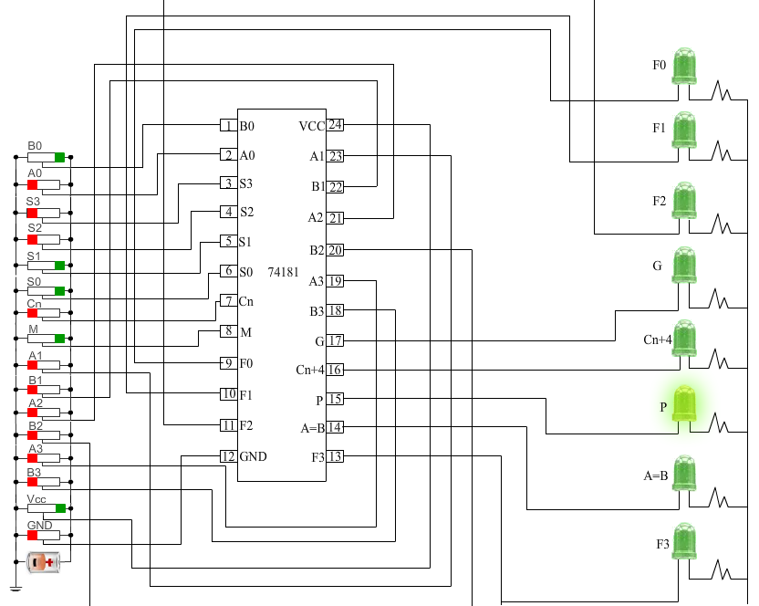
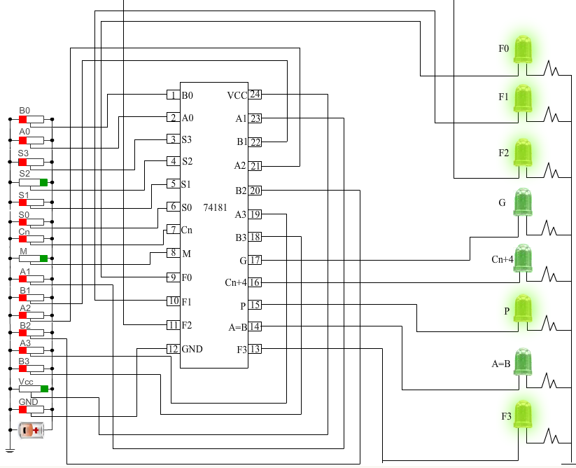
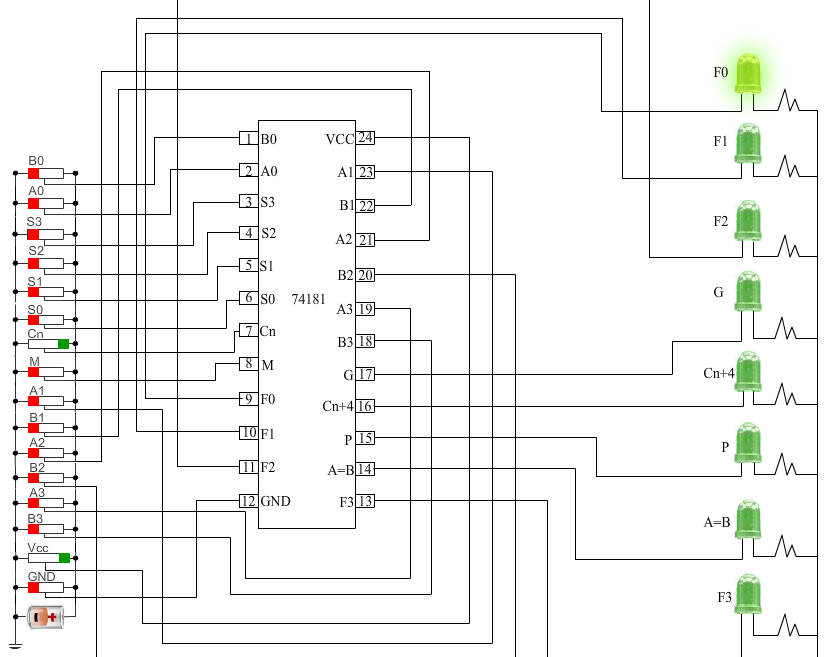
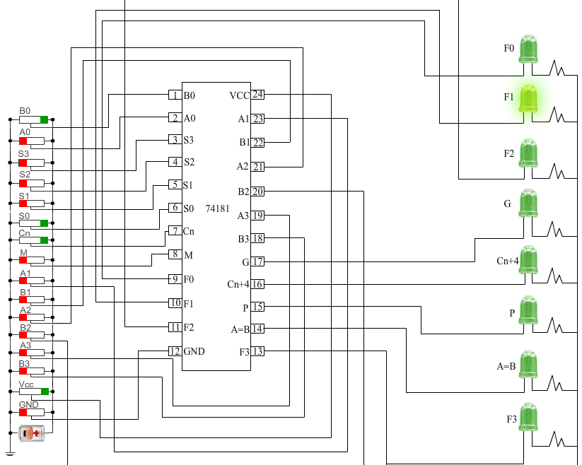
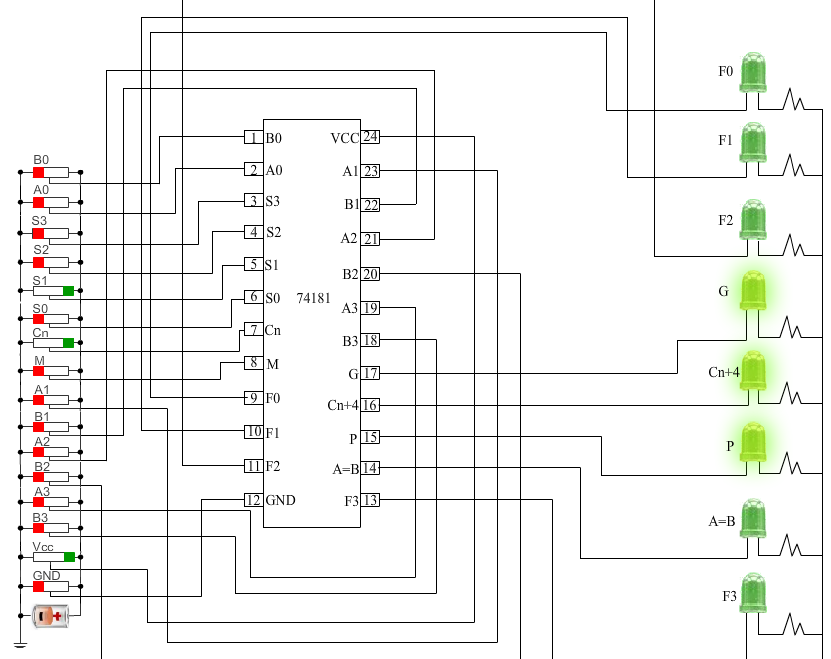
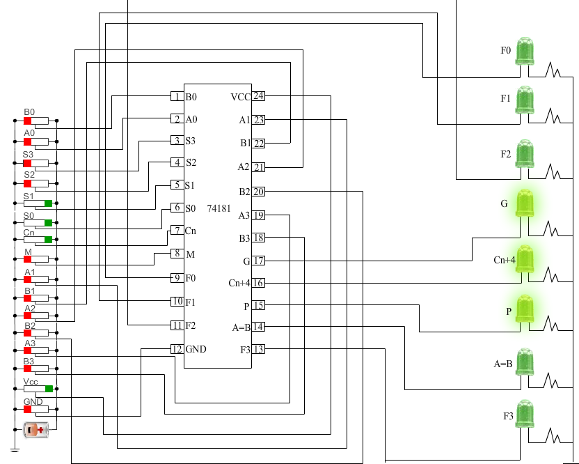
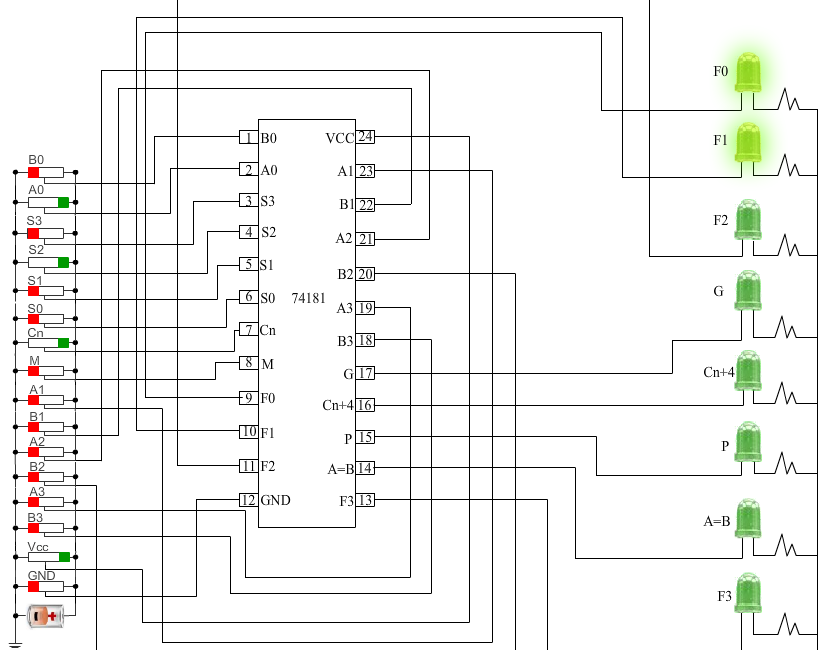

### Procedure
  
                            
                            

Please follow these steps to do the experiment.

                             
                             
                            
 
Part 1:

                         
<ul style="list-style:none">
 
 <li class="expt1"> 1.&nbsp; At first apply high voltage to Vcc.Then apply high voltage to M(mode control input) and low voltage to all the 4 select inputs.Logical operation will be performed.The output will be inverted A. 
   
 </ul>    
     
    </li>                      
  
   
   
                              
                               
                      
         <ul style="list-style:none">
 
 <li class="expt1"> 2.&nbsp;  Next, apply high voltage to S0 and apply low voltage to all other select inputs.The output will be A + B.  
    
</ul>    
     
    </li>                      
  
  
                               
                              
   
                                
                                                       
 <ul style="list-style:none">
 
 <li class="expt1"> 3.&nbsp;  Now apply high voltage to S1 and low voltage to all other select inputs.The output will be AB. 
    
</ul>    
     
    </li>                      
   
  
                                
                                 
                                 
                             
 <ul style="list-style:none">
 
 <li class="expt1"> 4.&nbsp;  Next, apply high voltage to S0 and S1 and low voltage to other select inputs.The output will be logical 1  
    
 </ul>    
     
    </li>                      
   
  
                               
                                 
                                 
                               
                                 
   <ul style="list-style:none">
    <li class="expt1"> 5.&nbsp;  Apply high voltage to S2 and apply low voltage to all other select inputs.The output will be AB.   
    
 </ul>    
     
    </li>                      
           

<ul style="list-style:none">
    <li class="expt1"> 6.&nbsp;  Apply all the combinations to all the select inputs and check the logical output.   
    
 </ul>    
     
    </li>                      		                         
                             
                               
 
                                 
								
<ul style="list-style:none">
    <li class="expt1"> 7.&nbsp;  Apply low voltage to mode control input and high voltage to Cin.Now the operation mode will be arithmetic mode.  
    
</ul>    
     
    </li>
	
	
<ul style="list-style:none">     
	
  <li class="expt1"> 8.&nbsp;  Next apply low voltages to all the select inputs.The output will be A + 1.  
    
</ul>    
     
    </li>                   
   
  
                             
							  
                               
								
                                

 <ul style="list-style:none">
 
<li class="expt1"> 9.&nbsp;Next, apply high voltage to S0 and low voltage to all other select inputs.The output will be A + B + 1. 
   
 </ul>    
     
    </li>                      
  
                                 
								 
                               
 <ul style="list-style:none">
 
<li class="expt1"> 10.&nbsp;  Apply high voltage to S1 and apply low voltages to all other select inputs.The output will be A + B. 
    
</ul>    
     
    </li>                      
  
 
                               
                                 
                                 
                               
                                                       
 <ul style="list-style:none">
 
 <li class="expt1"> 11.&nbsp;  Now apply high voltage to S0 and S1 and low volage to all other select inputs.The output will be -1 + 1.It means outputput will be zero. 
    
</ul>    
     
    </li>                      
   
  
                                
                                 
                                 
                             
<ul style="list-style:none">
 
 <li class="expt1"> 12.&nbsp;  Next, apply high voltage to S2 and low voltage to all other select inputs.The output will be A plus AB.  
    
</ul>    
     
    </li>                      
   
 
                               
                                 
                                                             
                        
