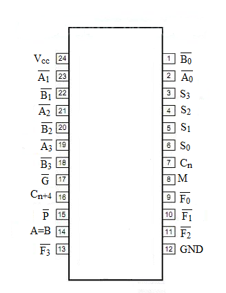
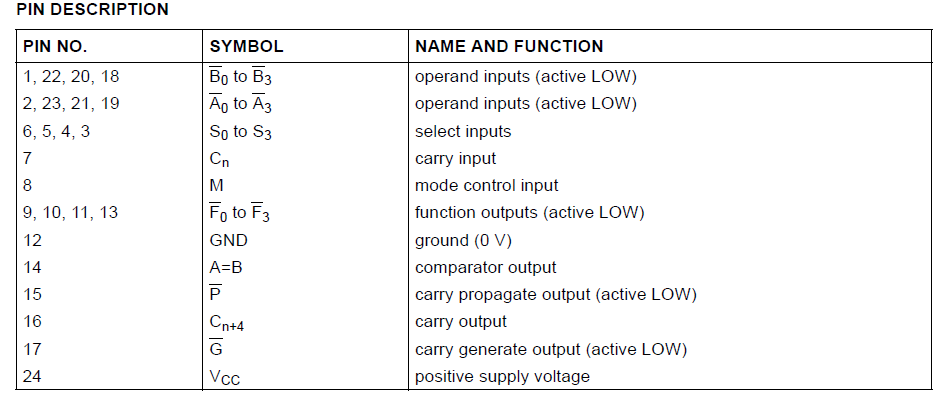
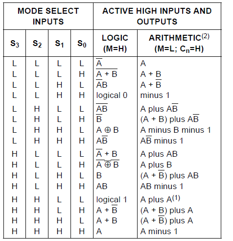
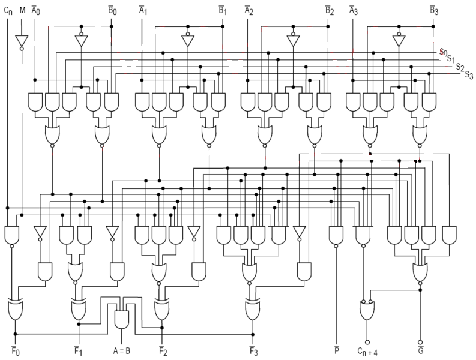

### Theory
 
                            
                            Arithmetic Logic Units:&nbsp;The 4 bit Arithmetic Logic Units perform 16 different Arithmetic operation and 16 different logical operation.This Arithmetic Logic Units controlled by 4 select inputs and one mode control input.
				 
				
 
				

                            
							 
							 
							Figure 1:&nbsp;Pin configuration of 74181(4 bit Arithmetic Logic Unit)
							
 
							 
							

							 
							 
							Figure 2:&nbsp;Pin description of 74181(4 bit Arithmetic Logic Unit)
							

 
       
                
  
				Functionality:&nbsp;When the model control input(M) is high,all internal carries are disabled and device performs logical operation on individual bits as listed.When Mode control input is low the carries are enabled and the device performs arithmetic operaion on two four bit words.THe Device includes full internal lookahead and provides for either ripple carry between devices using C n+4   output,for carry loclahead between packages using signals P </style>(Carry Propogate) and C </style> (Carry Generate).P </style> and G</style> are not affected by carry in.When speed requirement are not so much required, it can be used in a simple ripple carry mode by connecting the carry output signal (Cn+4 )signal to the carry input Cn of the next unit.For high speed operation the device is used in the conjuction wuth the 182 carry lookahead circuit.One carry lookahead package is required for each group of four 181' devices. Carry lookahead can be provided in various angle and provide at various levels and can offer high speed capability over long wordslength.The A=B output from the device goes High,when all four output from the device is high and can be used to indicate logical equivalance over 4bit when the unit is in subtract mode. The A=B output is open collector and can be wired AND with other A=B outputs to give a comparison for more than 4bits.The A=B signal can be used with Cn+4 signal to indicate A< B and A >B  
                
                     
  

The function table list the arithmetic operation that are performed without a carry in.An incoming carry adds a one to each operation.Thus the select code LHHS generates A minus B minus 1 (2s compliment notation) without a carry in and and generates A minus B when a carry is applied. Because subtraction is actually performed by complimentry addition (1s compliment),a carry out means borrow;thus a carry is generated when there is no under flow and no carry is generated when there is underflow.As indicated this device can be used with either active low inputs producing active low outputs or with ative high inputs producing active active high outputs.For either cause the table lists the operations that are performed to operends labled inside the logic symbol.

  

 

  
Figure 3:&nbsp;Functional Table of Arithmetic Logic Unit   

 

  
Figure 4:&nbsp;Logic Diagram of Arithmetic Logic Unit  

                            